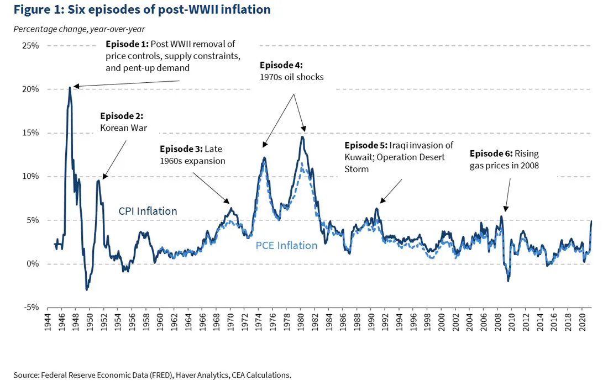
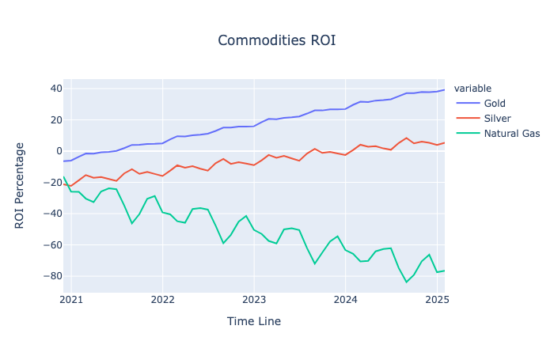
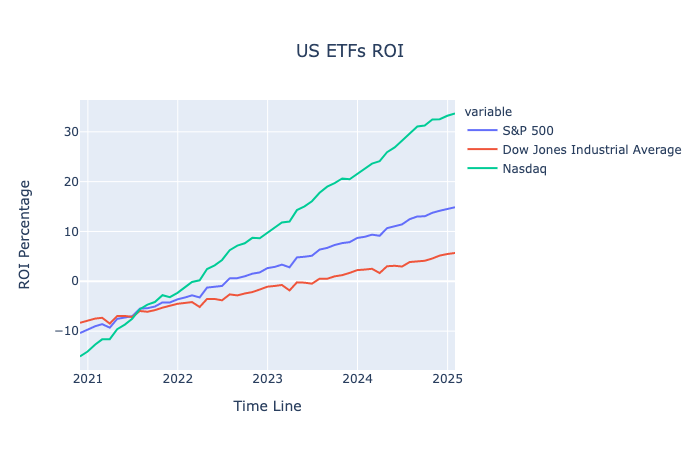
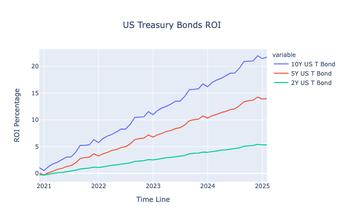

# Portfolio Diversification During Periods of Hyperinflation

## Summary

This project aims to continue the study of the best financial instruments during the current market conditions. In periods of hyperinflation and unreasonable monetary policy, it is essential to diversify your portfolio into " inflation-proof " assets that are not severely impacted by a non-functioning supply chain.

We define periods of hyperinflation as any time with inflation over 5%, the previous one happening in July 2008. According to the latest figures issued by the US Department of Labor, inflation in the United States reached a three-decade high in January '22, with prices of consumer goods and services rising by 8% year over year.

Supply chain problems are having a significant effect on the economy right now. Inventory-to-sale ratios have hit record lows across the economy and in the retail sector. Homebuilders say they don't have enough materials, and automakers don't have enough semiconductors. The fire is getting hotter because more people want to buy things. Travel demand, for example, has come back a lot faster than expected, which is straining airlines. In the same way, the number of vehicles sold in April more than doubled from last year, which is leaving dealer lots empty. Prices have gone up because of a rise in demand and a supply chain that isn't fully operational.

## Business Problem

Despite the Federal Reserve's repeated denials of requests to raise interest rates, referring to inflation fears as "transitory," the political repercussions of rising prices may eventually force the government to act. The stock market has responded gingerly to the news, with the benchmark S&P 500 index not dropping. Investors are rushing to protect their growth-oriented portfolios against danger in the current environment.

We analyzed various markets intending to inform the reader of possibilities for diversification of their growth portfolio:
  1. Commodities
  2. Bonds
  3. ETFs

## Data

The financial instruments analyzed and modeled using Facebook's Prophet algorithm are the following:

Bonds:
1. 10Y US T-Bond
2. 5Y US T-Bond
3. 2Y US T-Bond

ETFs:
1. S&P 500
2. Dow Jones Industrial Average
3. Nasdaq

Commodities:
1. Gold
2. Silver
3. Natural Gas

## Results

After training the model and tunning the parameters for optimal results, the following are the rankings of financial instruments by asset class per their return on investment and mean absolute percentage error: 

Commodities:
1. Gold - ROI: 39.2% | MAPE: 6.7%
2. Silver - ROI: 5.3% | MAPE: 14.8%
3. Natural Gas - ROI: -76.5% | MAPE: 44.0%

ETFs:
1. Nasdaq - ROI: 33.7% | MAPE: 22.2%
2. S&P 500 - ROI: 14.9% | MAPE: 18.0%
3. Dow Jones Industrial Average - ROI: 5.7% | MAPE: 16.9%

Bonds:
1. 10Y US T-Bond - ROI: 21.7% | MAPE: 7.1%
2. 5Y US T-Bond - ROI: 14% | MAPE: 3.2% 
3. 2Y US T-Bond - ROI: 5.3% | MAPE: 0.87

